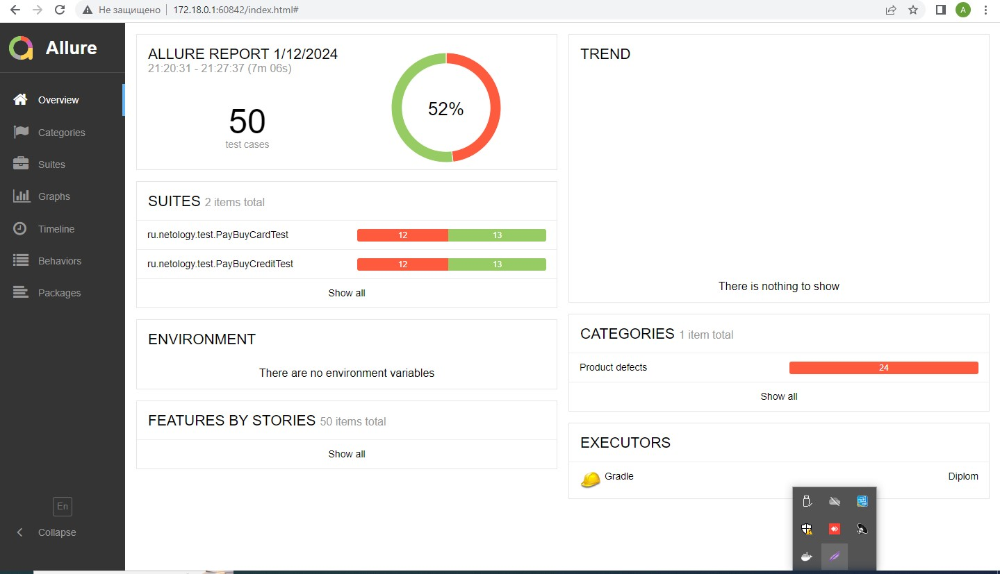
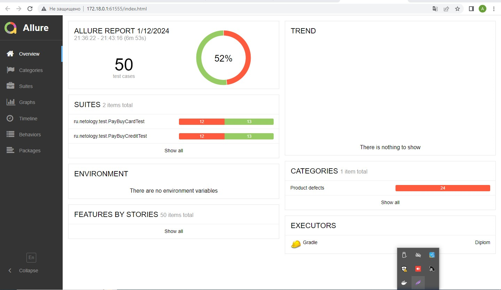

# Отчёт о проведённом тестировании.

## Краткое описание.

В процессе работы над проектом, было проведено автоматическое тестирование веб-сервиса, который предлагает купить тур по
оплате дебетовой картой и выдачей кредита по данным банковской карты.
Тестирование проводилось при подключении к базам Данных MySQL и PostgreSQL

## Колличество тест-кейсов.

Общее количество тест-кейсов: 50

- Оплата по дебетовой карте - 25
- Оплата по кредитной карте - 25

# Отчет автотестов Allure

### При подключении к базе данных MySQL

### При подключении к базе данных PostgreSQL

## Процент успешных и не успешных тест-кейсов.

- 26 - успешных - что составляет 52 %
- 24 - не успешных - что составляет 48 %

## Общие рекомендации.

1. Необходимо составить документацию для приложения
2. Исправить найденные ошибки https://github.com/AnnaKotovskaya/Diplom/issues